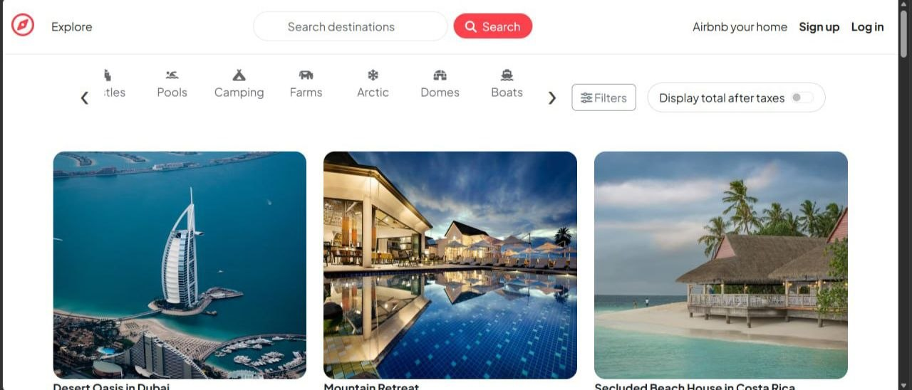
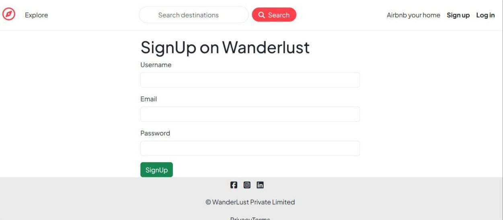
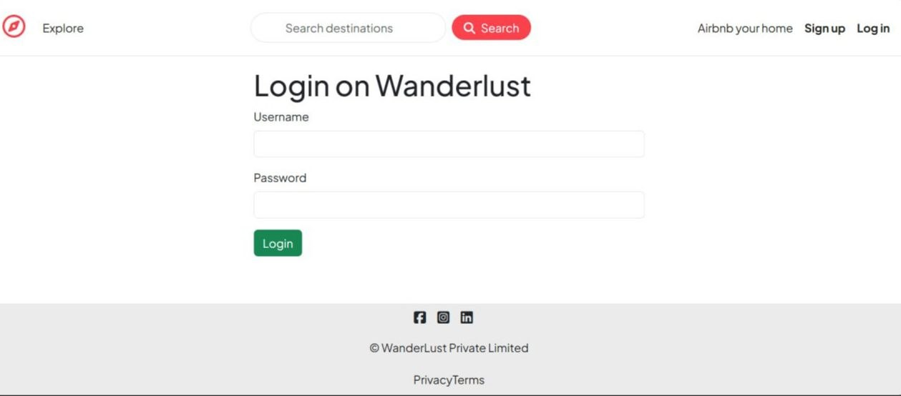
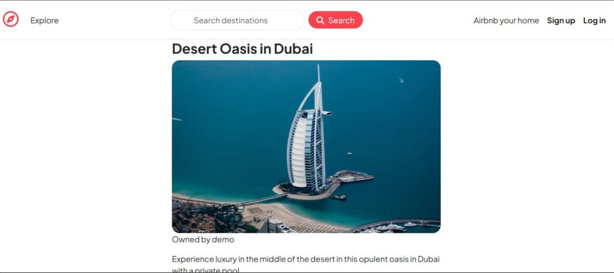
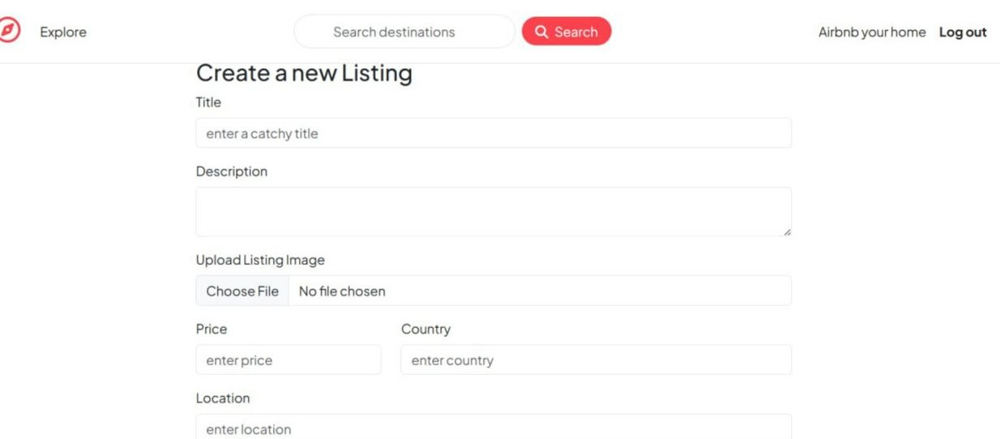

# Wanderlust 🏕️

A full-stack accommodation booking platform inspired by Airbnb. Users can browse properties, create listings, upload images, leave reviews, and manage listings through a secure authentication system.

## 🌟 Features

✅ User Authentication & Authorization

✅ Create, Edit & Delete Listings

✅ Cloudinary Image Upload

✅ Mapbox Location Integration

✅ Reviews & Ratings System

✅ Responsive UI with Bootstrap

✅ Session-Based Authentication

✅ Server-Side Validation using Joi

✅ MVC Architecture

---

## 🛠️ Tech Stack

### Frontend

* EJS
* HTML5
* CSS3
* Bootstrap
* JavaScript

### Backend

* Node.js
* Express.js

### Database

* MongoDB Atlas
* Mongoose

### Authentication

* Passport.js
* Express Session

### Third-Party Services

* Cloudinary
* Mapbox

---

## 📸 Screenshots

### Home Page




### Signup Page




### Login Page




### Listing Details

(./screenshots/listing2.jpg)

### Create Listing



## 🚀 Live Demo

Deployment Link:

https://wanderlust-mhh9.onrender.com/listings

---

## 📂 Project Structure

MajorProject/
│
├── controllers/
│   ├── listings.js
│   ├── reviews.js
│   └── users.js
│
├── init/
│   ├── data.js
│   └── index.js
│
├── models/
│   ├── listing.js
│   ├── review.js
│   └── user.js
│
├── node_modules/
│
├── public/
│   ├── css/
│   └── js/
│
├── routes/
│   ├── listing.js
│   ├── review.js
│   └── user.js
│
├── utils/
│   ├── ExpressError.js
│   └── wrapAsync.js
│
├── views/
│   ├── includes/
│   ├── layouts/
│   ├── listings/
│   └── users/
│
├── .env
├── .gitignore
├── app.js
├── cloudConfig.js
├── middleware.js
├── schema.js
├── package.json
└── package-lock.json

---

## ⚙️ Installation & Setup

### 1. Clone Repository

```bash
git clone https://github.com/parth0811/wanderlust.git
cd wanderlust
```

### 2. Install Dependencies

```bash
npm install
```

### 3. Create .env File

```env
ATLASDB_URL=
SECRET=

CLOUD_NAME=
CLOUD_API_KEY=
CLOUD_API_SECRET=

MAP_TOKEN=
```

### 4. Run Application

```bash
node app.js
```

Server will start on:

```text
http://localhost:8080
```

---

## 🎯 How It Works

1. User browses listings.
2. Users can register/login securely.
3. Authenticated users can create listings.
4. Images are uploaded to Cloudinary.
5. Location data is displayed using Mapbox.
6. Users can leave reviews and ratings.
7. Listing owners can edit or delete their listings.

---

## 🔑 Environment Variables

Required variables:

```env
ATLASDB_URL=
SECRET=
CLOUD_NAME=
CLOUD_API_KEY=
CLOUD_API_SECRET=
MAP_TOKEN=
```

---

## 🎓 Learning Outcomes

* RESTful Routing
* Authentication & Authorization
* MongoDB Data Modeling
* MVC Architecture
* Cloudinary Integration
* Session Management
* Form Validation
* Error Handling
* Deployment on Render

---

## 🔮 Future Enhancements

* Booking System
* Payment Integration
* Wishlist Feature
* User Profiles
* Advanced Search Filters
* Property Availability Calendar

---

## 🐛 Troubleshooting

### MongoDB Authentication Failed

Verify:

* Atlas cluster is running
* Database user exists
* Password is correct
* Network Access allows connections

### Cloudinary Upload Error

Verify:

* CLOUD_NAME
* CLOUD_API_KEY
* CLOUD_API_SECRET

### Map Not Loading

Verify:

* MAP_TOKEN is valid

### Render Deployment Issues

Check:

* Environment Variables
* Build Logs
* MongoDB Connection String

---

## 👨‍💻 Author

Parth Girdhar

LinkedIn:
https://www.linkedin.com/in/parth-girdhar0811/

GitHub:
https://github.com/parth0811

---

## 📜 License

This project is created for educational and portfolio purposes.